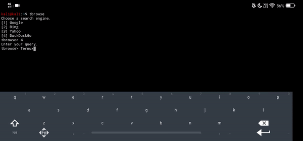

# tbrowse
**Surf the web with Termux using w3m but tbrowse lets you choose the search engine!**

  => git clone https://github.com/Mini-Ware/tbrowse
  ==> cd tbrowse
  ===> chmod +x install.sh
  ====> ./install.sh
  =====> tbrowse
